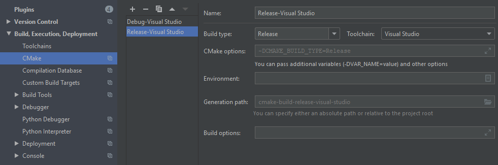
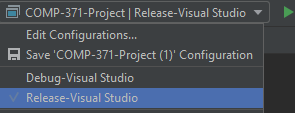

# COMP-371-Proj
## Requirements
 - For the first build, requires an active internet connection to fetch dependencies.
 
## Royal Octopi Team Members
 - Zahra Nikbakht 40138253
 - Philip Dumaresq 40082638
 - William Tarte 40087900
 - Mohammad Ali Zahir 40077619
 - Ewan McNeil 40021787
 
## Library Versions
 - glfw-3.3.2
 - glew-2.1.0
 - glm-0.9.9.8
 - Minimum OpengGL version = 3.3
 - Minimum CMake version =  3.14
 
## Installation Guide
_This project has been successfully compiled on both Arch Linux Manjaro using GCC  
and on Windows 10 using Microsoft Visual Studio 2017's compiler (MSVC)_

__Method 1__
1. Clone the repository or download the zip file and unzip it.
2. Open the project in either CLion or VS2017.
3. If Using CLion on Windows, go to File > Settings > __Build, Execution, Deployment__ > Toolchain; and set the current toolchain to Visual Studio.
4. Build/Run the project.  
  
__Method 2: Install Script__
1. [Download/Run CMake .msi installer](https://cmake.org/download/) and make sure to link it to PATH (might require restart).
2. Clone the repository or download the zip file and unzip it.
3. Open the project folder, and right-click on install.bat > run as administrator and accept.
4. If there are no errors, there should be a new folder called "build". Open it and the .exe should be there.

## Building & Running in Release Mode
    __



## Controls - SOME TODO once Player is implemented
 - WS/AD moves the camera forwards/backwards and left/right.
 - Using the mouse, you can change the direction/orientation of the camera.

## Adding Blocks to the game
 - When adding new blocks to the game, you need to create a new <block_name>.block file under `resources/blocks` based off `dirt.block`. You then need to add the ID of your block (has to be unique) to the `BlockID` enum in `block.h`.
 Also, make sure to add the appropriate switch case to the `operator<<` overload for debugging purposes.

## Resources
 - https://learnopengl.com/
 - https://en.cppreference.com/w/
 - https://www.khronos.org/registry/OpenGL-Refpages/gl4/
 - http://devernay.free.fr/cours/opengl/materials.html
 - https://github.com/amrayn/easyloggingpp
 - https://github.com/tinyobjloader/tinyobjloader
 
## Logging
```c++
#include "easylogging++.h"
[...]
void someMethod() {
   LOG(INFO) << "My first info log using default logger";
   return;
}
```
|   Level  |                 Description                                                                                                                                   |
|----------|---------------------------------------------------------------------------------------------------------------------------------------------------------------|
| Global   | Generic level that represents all levels. Useful when setting global configuration for all levels.                                                            |
| Trace    | Information that can be useful to back-trace certain events - mostly useful than debug logs.                                                                  |
| Debug    | Informational events most useful for developers to debug application. Only applicable if NDEBUG is not defined (for non-VC++) or _DEBUG is defined (for VC++).|
| Fatal    | Very severe error event that will presumably lead the application to abort.                                                                                   |
| Error    | Error information but will continue application to keep running.                                                                                              |
| Warning  | Information representing errors in application but application will keep running.                                                                             |
| Info     | Mainly useful to represent current progress of application.                                                                                                   |
| Verbose  | Information that can be highly useful and vary with verbose logging level. Verbose logging is not applicable to hierarchical logging.                         |
| Unknown  | Only applicable to hierarchical logging and is used to turn off logging completely.                                                                           |

## A few Gotchas with C++
 - For Singletons: Once you write the implementation in the .cpp file, make sure you declare the singleton instance at the top of the file. See texture_database.cpp for an example.
 - If you define a function (not a class method) in a header file, make sure it is defined as `inline`.